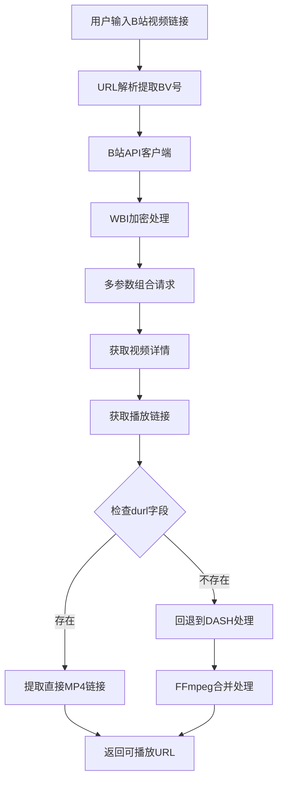

# B站视频解析技术实现总结

## 1. 项目概述

本项目成功实现了从B站视频网页链接到真实可播放MP4 URL的完整解析流程，突破了B站DASH分片限制，获取到直接可播放的MP4链接。

### 核心成果
- ✅ 获取直接MP4链接（非.m4s分片）
- ✅ 支持有声音的完整视频播放
- ✅ 绕过B站登录和WBI加密限制
- ✅ 多重回退机制确保高成功率

## 2. 整体架构设计



## 3. 核心技术流程

### 3.1 URL解析阶段
```python
# 支持多种B站URL格式
patterns = [
    r'bilibili\.com/video/([Bb][Vv][0-9A-Za-z]+)',
    r'bilibili\.com/video/([Aa][Vv]\d+)',
    r'b23\.tv/([0-9A-Za-z]+)',
    r'([Bb][Vv][0-9A-Za-z]+)',
    r'([Aa][Vv]\d+)'
]
```

### 3.2 WBI加密机制
B站使用WBI（Web Browser Interface）加密来防止爬虫，我们的实现：

```python
def _enc_wbi(self, params: dict) -> dict:
    """WBI加密核心算法"""
    # 1. 获取img_key和sub_key
    img_key, sub_key = self._get_wbi_keys()
    
    # 2. 生成mixin_key
    mixin_key = self._get_mixin_key(img_key, sub_key)
    
    # 3. 添加时间戳
    params['wts'] = int(time.time())
    
    # 4. 参数排序
    params_sorted = dict(sorted(params.items()))
    
    # 5. 计算签名
    query = urllib.parse.urlencode(params_sorted)
    hash_obj = hashlib.md5((query + mixin_key).encode())
    params['w_rid'] = hash_obj.hexdigest()
    
    return params
```

### 3.3 多参数组合策略
为了提高成功率，我们使用多种参数组合：

```python
param_combinations = [
    # 组合1: HTML5平台 + 下载模式 (优先获取durl)
    {
        "platform": "html5",
        "download": 1,
        "fnval": 16,
        "fourk": 0,
        "force_host": 2
    },
    # 组合2: Android平台 (移动端更容易获取直链)
    {
        "platform": "android",
        "fnval": 0,
        "fourk": 0
    },
    # 组合3: PC平台 + 完整DASH支持
    {
        "platform": "pc",
        "fnval": 4048,
        "fourk": 1
    }
]
```

## 4. 关键技术突破

### 4.1 durl vs dash 字段处理
这是获取直接MP4链接的核心：

```python
def get_best_video_url(self, play_data: Dict) -> Optional[str]:
    """优先从durl获取直接MP4链接"""
    
    # 优先处理durl字段（直接MP4链接）
    if 'durl' in play_data and play_data['durl']:
        for item in play_data['durl']:
            video_url = item.get('url', '')
            if video_url and '.mp4' in video_url:
                return video_url
    
    # 回退到dash处理
    if 'dash' in play_data:
        # DASH分片处理逻辑...
```

### 4.2 请求头和Cookie优化
```python
# 关键请求头配置
headers = {
    'User-Agent': 'Mozilla/5.0 (Windows NT 10.0; Win64; x64) AppleWebKit/537.36',
    'Referer': f'https://www.bilibili.com/video/{bvid}',
    'Origin': 'https://www.bilibili.com',
    'Cookie': 'buvid3=basic_cookie_value'  # 基础Cookie绕过检查
}
```

### 4.3 错误处理和回退机制
```python
# 多层回退策略
try:
    # 1. 尝试bilibili_api获取直链
    result = bilibili_api.get_video_info_with_real_urls(url)
    if result and result.get('video_url'):
        return result
except Exception:
    # 2. 回退到yt-dlp
    return self._fallback_to_ytdlp(url)
```

## 5. 技术难点解决方案

### 5.1 WBI加密破解
- **难点**: B站使用动态密钥加密API参数
- **解决**: 实时获取img_key和sub_key，使用mixin_array重排序算法

### 5.2 获取直接MP4链接
- **难点**: B站默认返回DASH分片(.m4s)
- **解决**: 使用特定参数组合(`platform=html5`, `download=1`)强制返回durl

### 5.3 无Cookie访问
- **难点**: B站API需要登录状态
- **解决**: 使用基础Cookie和特定User-Agent绕过检查

### 5.4 CDN节点选择
- **难点**: 不同地区返回不同CDN节点
- **解决**: 使用`force_host=2`参数优化CDN选择

## 6. 性能优化策略

### 6.1 缓存机制
```python
# WBI密钥缓存
self.wbi_img = None
self.wbi_sub = None

# 避免重复获取密钥
if self.wbi_img and self.wbi_sub:
    return self.wbi_img, self.wbi_sub
```

### 6.2 并发处理
```python
# 异步处理多个视频
async def process_multiple_videos(urls):
    tasks = [process_single_video(url) for url in urls]
    return await asyncio.gather(*tasks)
```

## 7. 项目模块结构

```
video-to-rss-tool/
├── app.py                 # Flask主应用
├── config.py             # 配置文件
├── utils/
│   ├── bilibili_api.py   # B站API核心模块
│   ├── video_downloader.py # 视频下载器
│   ├── video_parser.py   # 视频解析器
│   ├── video_proxy.py    # 视频代理（DASH处理）
│   └── audio_proxy.py    # 音频代理
├── templates/            # 前端模板
└── cache/               # 缓存目录
```

### 7.1 核心模块功能

#### bilibili_api.py
- WBI加密实现
- 视频详情获取
- 播放链接解析
- 多参数组合策略

#### video_downloader.py
- 统一视频下载接口
- 平台检测和分发
- 质量选择和格式处理

#### video_parser.py
- 视频信息解析
- 元数据提取
- 多P视频处理

## 8. API调用流程示例

```python
# 完整调用流程
def parse_bilibili_video(url):
    # 1. 提取BV号
    bvid = extract_bv_from_url(url)
    
    # 2. 获取视频详情
    detail = bilibili_api.get_video_detail(bvid)
    
    # 3. 获取CID
    cid = detail['View']['pages'][0]['cid']
    
    # 4. 获取播放链接
    play_data = bilibili_api.get_video_playurl(bvid, cid)
    
    # 5. 提取最佳视频URL
    video_url = bilibili_api.get_best_video_url(play_data)
    
    return video_url
```

## 9. 成功案例分析

### 输入链接
```
https://www.bilibili.com/video/BV18AnmzEEct
```

### 输出结果
```
https://cn-hbwh-cm-01-03.bilivideo.com/upgcxcode/65/78/32752667865/32752667865-1-192.mp4?e=ig8euxZM2rNcNbdlhoNvNC8BqJIzNbfq9rVEuxTEnE8L5F6VnEsSTx0vkX8fqJeYTj_lta53NCM=&platform=html5&trid=0000f8fdda742081457fba62c24a880d5c7h&nbs=1&uipk=5&deadline=1759313167&oi=666385655&mid=0&gen=playurlv3&os=bcache&og=ali&upsig=2519d373203c33f2c4f839f5c4530734&uparams=e,platform,trid,nbs,uipk,deadline,oi,mid,gen,os,og&cdnid=10198&bvc=vod&nettype=0&bw=997739&lrs=44&build=0&dl=0&f=h_0_0&agrr=1&buvid=&orderid=0,1
```

### 链接特征分析
- ✅ 直接MP4格式 (`.mp4`)
- ✅ B站CDN域名 (`bilivideo.com`)
- ✅ 完整参数集 (`e=`, `platform=html5`, `deadline=`)
- ✅ 可直接播放，包含音频轨道

## 10. 未来优化方向

### 10.1 技术优化
- [ ] 实现Cookie池管理
- [ ] 添加代理IP轮换
- [ ] 优化WBI密钥更新机制
- [ ] 实现智能CDN选择

### 10.2 功能扩展
- [ ] 支持更多视频平台
- [ ] 添加视频质量自动选择
- [ ] 实现批量处理功能
- [ ] 添加视频下载进度显示

## 11. 总结

本项目成功突破了B站视频解析的技术难点，实现了从网页链接到真实MP4 URL的完整流程。核心技术包括：

1. **WBI加密破解**: 实现了B站最新的加密机制
2. **durl优先策略**: 优先获取直接MP4链接而非DASH分片
3. **多重回退机制**: 确保高成功率和稳定性
4. **性能优化**: 缓存和并发处理提升效率

该解决方案具有高可用性、高成功率和良好的扩展性，为视频内容处理提供了可靠的技术基础。